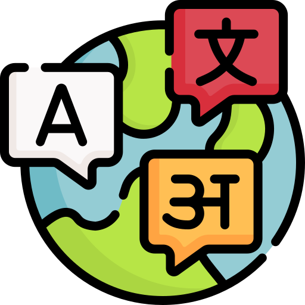

<h1 align="left">Hey! Nice to see you </h1>
<!-- https://github.com/digitalinnovationone/dio-lab-open-source/blob/main/utils/badges/badges.md -->
<table align="right">
    <tr><td> Languages</a></td></tr>
    <tr><td>
 English ★★☆
</td></tr>
    <tr><td>
 Portuguese ★★★
</td></tr>
    <tr><td>
 Italian ★★☆
</td></tr>
    <tr><td>
 Spanish ★☆☆
</td></tr>
    <tr><td>
 German ★☆☆
</td></tr>
</table>

<h3 align="left"> 
    </a> Hi, I'm Vinicius Garcia. I am a software
development enthusiast.</h3>

- Certified in Full Stack Web Development at Kenzie Academy Brazil's intensive bootcamp; 

- Went from zero programming knowledge to developing a complex full stack project alone within a year;

- Dual citizen 🇧🇷 🇮🇹, residing in 🇬🇧;

- Bachelor's degree in law; 

## 🛠  Technologies and tools

## 📖  What I am currently learning / improving on

## 👾  What I am interested in learning at some point

## 🔍  Where to find me

