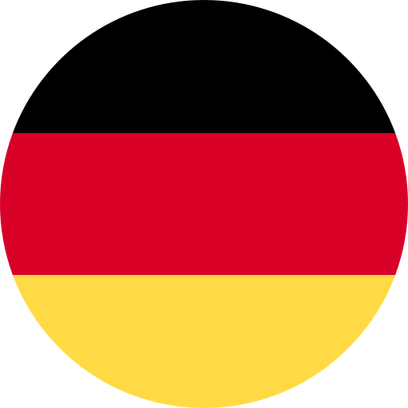

<h1 align="center"> Hey! Nice to see you </h1>

<!-- 

    

 -->

<h3 align="center"> 
    </a> Hi, I'm Vinicius Garcia. 
</h3>

 
    
    

<table align="right">
    <tr><td> Languages</a></td></tr>
    <tr><td>
 English ★★☆
</td></tr>
    <tr><td>
 Portuguese ★★★
</td></tr>
    <tr><td>
 Italian ★★☆
</td></tr>
    <tr><td>
 Spanish ★☆☆
</td></tr>
    <tr><td>
 German ★☆☆
</td></tr>
</table>
